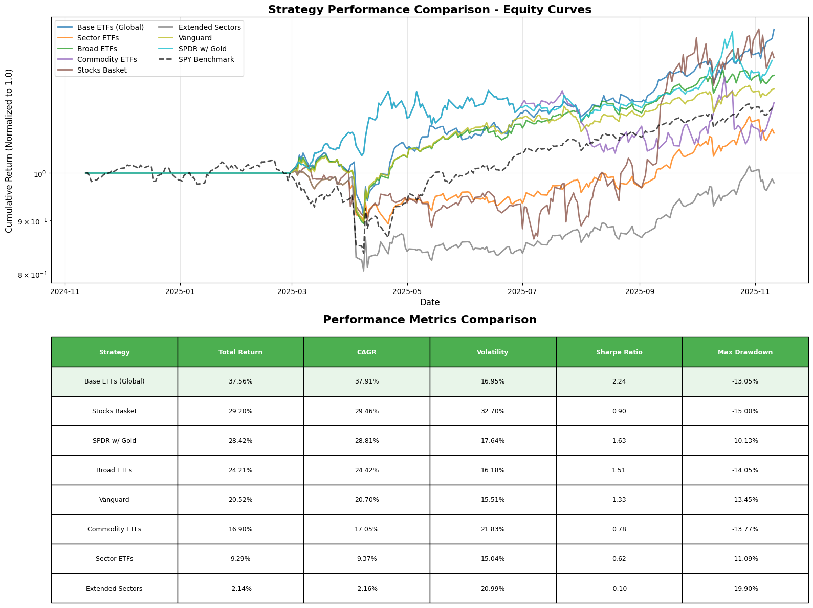
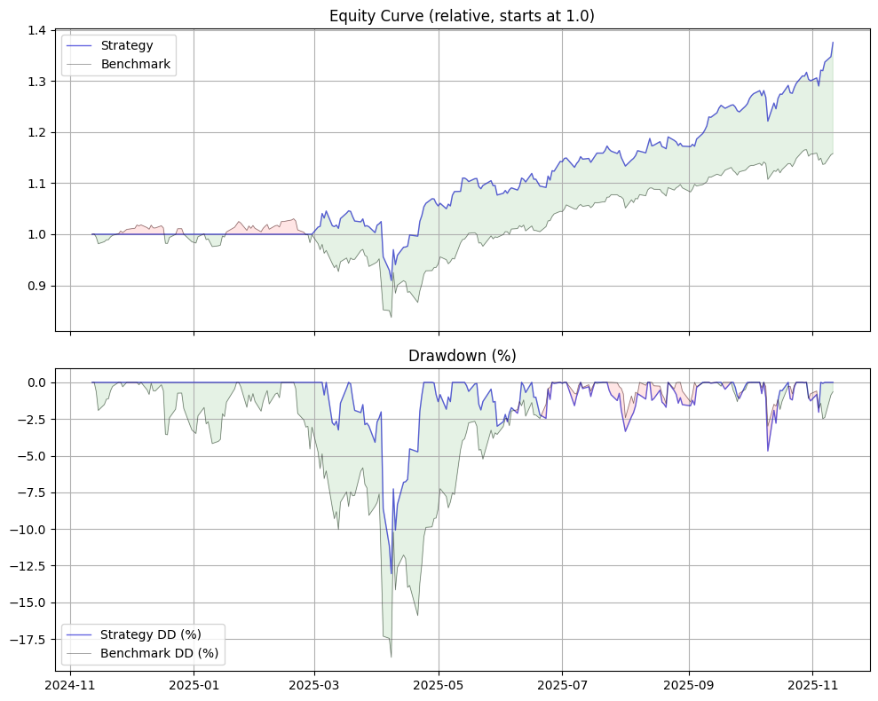
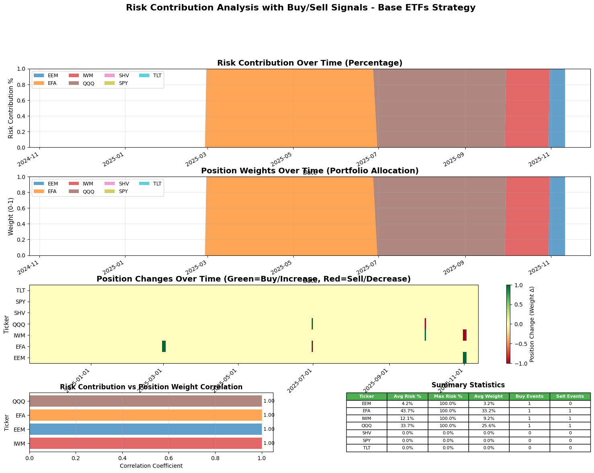
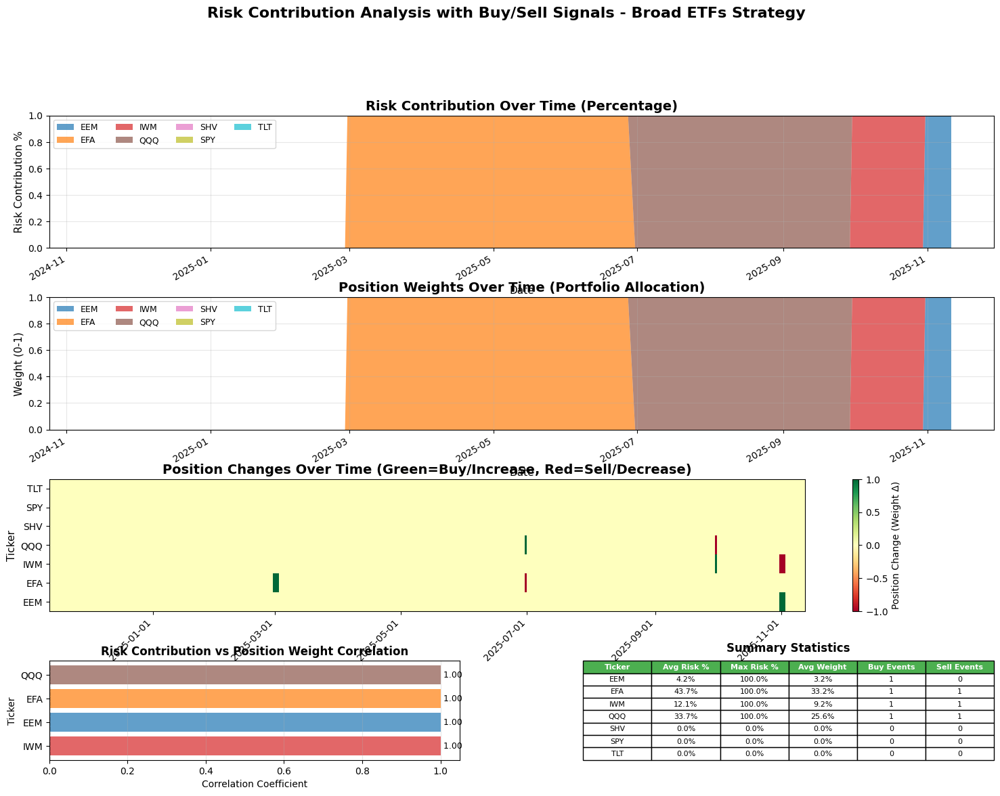

# portwine - a clean, elegant portfolio backtester

```commandline
pip install portwine
```

---
TLDR: The Base ETF and Broad ETF seems to offer steady returns above SPY with limited drawdown.
---

##### SimpleSeekingAlphaStrategy (folder examples)

This example shows how the platform makes building and analyzing a basic equity rotation strategy simple.
Below, we use the `EquityDrawdownAnalyzer` to visualize the portfolio drawdowns for an "all_ETF" portfolio—a diversified portfolio including all selected ETFs. The output chart (`examples/all_etf.png`) gives a quick overview of how the portfolio performed during market stress periods and helps identify potential risk episodes.

```python
EquityDrawdownAnalyzer().plot(results)
```



---

##### Monte Carlo Analysis

The Monte Carlo Analysis module helps simulate alternative portfolio equity paths using resampled returns from your strategy. The resulting chart (`examples/base_etf_chart.png`) illustrates potential future equity curves, helping you visualize risk and uncertainty beyond just the historical experience. The "base_etf" here typically refers to a single core ETF (such as SPY or a similar benchmark) used as a reference or a baseline for comparison in simulations.

```python
MonteCarloAnalyzer().plot(results)
```



---

##### Seasonality Analysis

The Seasonality Analyzer can help reveal how your strategy or instrument tends to behave during certain months or quarters. In the example below, we use `EquityDrawdownAnalyzer` to look at historical drawdowns for the base ETF portfolio, as represented in (`examples/base_etf.png`), highlighting periods of seasonal weakness or strength.

```python
EquityDrawdownAnalyzer().plot(results)
```



With more analytical tools and visualizations on the way!

The following chart illustrates the performance of a "broad_etf" portfolio, which typically includes a diverse set of ETFs spanning multiple asset classes, sectors, or geographies, providing a view of risk and returns across a wide investment universe.



With more on the way!

---

### Docs

https://stuartfarmer.github.io/portwine/
